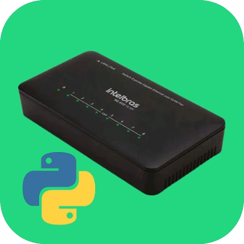
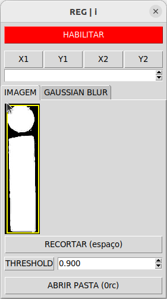

# INSPEÇÃO-TAMPOGRAFIA-SWITCH-8P

Projeto inspeção-tampografia consiste em identificar erros gráficos nas tampas dos switch's do CMD. <br>
Neste projeto estão envolvidas três  entidades:  

- IHM (Interface Humano Computador) feita pelos Jovens Aprendizes;
- INSPEÇÃO feita por Felipe Cabral;
- ARDUINO feita por Felipe Cabral;

# Pré-requesitos
- É necessário o uso do sistema operacional Ubuntu 22.04.5 LTS, não é oferecido suporte para outros sistemas operacionais.
- Python, acima da versão 3.10

# Instalação
Com os pré-requesitos já supridos, se pode realizar a cópia do projeto na sua máquina utilizando o comando abaixo.
 ```bash
    git clone --recurse-submodules https://git.intelbras.com.br/equipe-automacao/injetora/inspecao-switch-8p.git
```
Depois da cópia ser feita, entre ná pasta do projeto e insira a permissão de execução para script `setup.sh`, depois o execute.
```bash
  chmod +x setup.sh ; ./setup.sh
```

Se a execução tiver sucesso, todas as bibliotecas do projeto serão instaladas, também será criado um atalho na Área de Trabalho para execução do projeto. Álem disso o projeto será configurado para abrir automaticamente ao se logar no computador.

(Opcional) Caso já tenha sido feita as configurações para inspeção previamente, é preciso que você o cole na pasta inicial do projeto, com o nome de conf.json

#   Utilização

## Processo de inspeção com interface
Se a instalação do projeto for um sucesso, será possível utilizar o programa através do atalho ou do início programado do sistema

## Linha de comando
Além do uso cotidiano através do atalho, também tem acesso a outras funções a partir do uso do terminal.

Mostra todas as opções e parâmetros utilizáveis.
```bash
  python3 inspection.py -h
```

### Adição de modelos na lista de modelos inspecionáveis
Irá adicionar o modelo na lista de modelos que podem ser inspecionados pelo aplicativo.
```bash
  python3 inspection.py add <Nome do modelo> <código do modelo> <procedimento de inspeção>
```
**exemplo:**
```bash
   python3 inspection.py add "SG800 Q+" 4760089 D
```
Os **procedimentos de inspeção** é a forma que o aplicativo irá abordar a inspeção do produto, para poder abranger as diversas necessidades. 
O procedimento pode assumir estas categorias:

- **A**: Apenas irá salvar a imagem da placa sem inspeção, colocando-a na pasta `<modelo>/geral/sem_clasif` (sem_classificação) organizada na respectiva pasta de modelo.


- **B**: Irá inspecionar a placa e salva-lá na pasta respectiva ao resultado da inspeção dentro da pasta do seu respectivo modelo, se o resultado for um reprovado irá salvar ná `<modelo>/geral/com_clasif/nok`, caso seja uma aprovação será salvo ná pasta `<modelo>/geral/com_clasif/ok`.


- **C**: Irá inspecionar a placa e enviar o resultado para outros módulos da inspeção, como o IHM (Tela), não realizando o arquivamento da foto.


- **D**: De forma similar ao procedimento **B** e **C**, o aplicativo irá inspecionar a placa, logo em seguida enviando para os outros módulos e salvando nas pastas referentes ao resultado. Porém, as pastas que são salvas são `<modelo>/teste/ok` e `<modelo>/teste/nok`  

### Remoção de modelos da lista de modelos inspecionáveis
Irá remover o modelo da lista, utilizando o nome ou o código do modelo como referente.

`$ inspection.py del (-n <Nome do modelo> OU -c <Código do modelo>)`

**exemplo**: 
```bash
   python3 inspection.py del --name "SG800 Q+"` ou `$ python3 inspection.py del --code 4760089
```
## Inserindo as classes de inspeção dos modelos
Depois de inserir o modelo na lista de modelos inspecionáveis, é necessário colocar as partes da tampografia que serão verificadas, resultando na aprovação ou reprovação.

Para isso é necessário usar o programa **_Inspection_**, localizado na pasta raiz do projeto, pelo comando: 

`$ python3 inspection.py inspect (--name <Nome do modelo> OU -c <Código do modelo>) pad-inspection`

**exemplo:** 
```bash
  python3 inspection.py inspect --name "SG800 Q+" pad-inspection
```


Depois acesse a imagem do produto atravez do **FILE** (Botão no canto superior esquerdo) **> OPEN > "CAMINHO DA FOTO"**

Ou se você estiver com a câmera de inspeção já direcionado ao produto você pode acessar a visualização da câmera **FILE > OPEN CAMERA**

Como resultado irá aparecer a tela de inspeção


Para realizar a inspeção de cada partes é preciso indicar a aréa de sua verificação.
Exemplo do "I" da placa, no qual indicamos a sua área e a nomeamos. 


Ao clicar na área de verificação recém criada, irá abrir uma tela no qual poderá fazer os recortes que serão usados na inspeção. Também permitindo habilitar ou desabilitar a inspeção dessa região apartir do botão de **Habilitar** no topo da janela.


