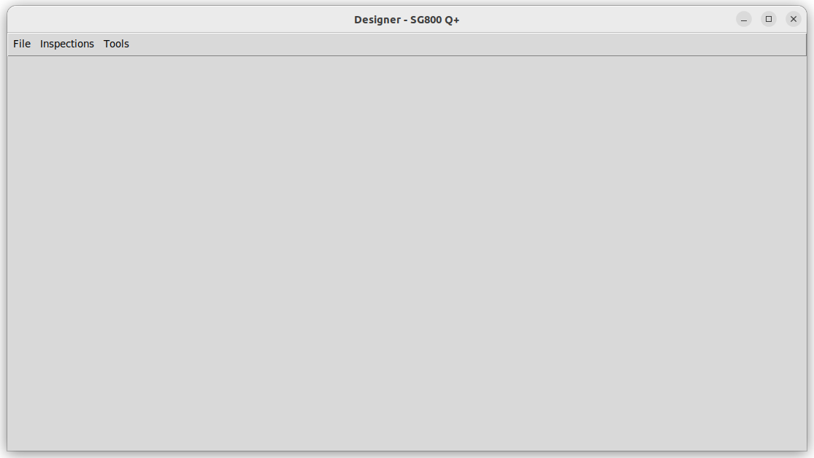
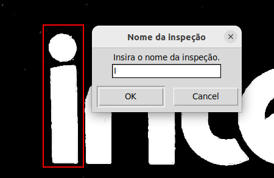

# INSPEÇÃO-TAMPOGRAFIA-SWITCH-8P

Projeto inspeção-tampografia consiste em identificar erros gráficos nas tampas dos switch's do CMD.  
Neste projeto estão envolvidas três  entidades:  

- IHM (Interface Humano Computador) feita pelos Jovens Aprendizes;
- INSPEÇÃO feita por Felipe Cabral;
- ARDUINO feita por Felipe Cabral;

## Pré-requesitos
É necessário o uso do sistema operacional Ubuntu 22.04.5 LTS, não é oferecido suporte para outros sistemas operacionais.

## Instalação
Com os pré-requesitos já supridos, se pode realizar a cópia do projeto na sua máquina utilizando o comando abaixo.
 
`$ git clone --recurse-submodules https://git.intelbras.com.br/equipe-automacao/injetora/inspecao-switch-8p.git`

Depois da cópia ser feita, entre ná pasta do projeto e insira a permissão de execução para script `setup.sh`, depois o execute.

`$ chmod +x setup.sh ; ./setup.sh`

Se a execução tiver sucesso, todas as bibliotecas do projeto serão instaladas, também será criado um atalho na Área de Trabalho para execução do projeto. Álem disso o projeto será configurado para abrir automaticamente ao se logar no computador.

(Opcional) Caso já tenha sido feita as configurações para inspeção previamente, é preciso que você o cole na pasta inicial do projeto, com o nome de conf.json

## Utilização

### Processo de inspeção com interface
Se a instalação do projeto for um sucesso, será possível utilizar o programa através do atalho ou do início programado do sistema

### Linha de comando
Além do uso cotidiano através do atalho, se tem acesso a outras funções a partir do uso do terminal.

Mostra todas as opções e parâmetros utilizáveis.

`$ python3 inspection.py -h`

#### Adição de modelos na lista de modelos inspecionáveis
Irá adicionar o modelo na lista de modelos que podem ser inspecionados pelo aplicativo.
`$ python3 inspection.py add <Nome do modelo> <código do modelo> <procedimento de inspeção>`

**exemplo:**
`$ python3 inspection.py add "SG800 Q+" 4760089 D`

Os **procedimentos de inspeção** é a forma que o aplicativo irá abordar a inspeção do produto, para poder abranger as diversas necessidades. 
O procedimento pode assumir estas categorias:

**A**: Apenas irá salvar a imagem da placa sem inspeção, colocando-a na pasta `geral/sem_clasif` (sem_classificação) de sua respectiva pasta de imagens.

**B**: Irá inspecionar a placa e salva-lá na pasta respectiva ao resultado da inspeção dentro da pasta do modelo, se o resultado for um reprovado irá salvar ná `geral/com_clasif/nok`, caso seja uma aprovação será salvo ná pasta `geral/com_clasif/ok`.

**C**: Irá inspecionar a placa e enviar o resultado para outros módulos da inspeção, como o IHM (Tela), não realizando o arquivamento da foto.

**D**: De forma similar ao procedimento **B** e **C**, o aplicativo irá inspecionar a placa, logo em seguida enviando para os outros módulos e salvando nas pastas referentes ao resultado. Porém, as pastas que são salvas são `teste/ok` e `teste/nok`  

#### Remoção de modelos da lista de modelos inspecionáveis
Irá remover o modelo da lista, utilizando o nome ou o código do modelo como referente.

`$ inspection.py del (-n <Nome do modelo> OU -c <Código do modelo>)`

**exemplo**: `$ python3 inspection.py del --name "SG 800 Q+"` ou `$ python3 inspection.py del --code 4760089`

### Inserindo as classes de inspeção dos modelos
Depois de inserir o modelo na lista de modelos inspecionáveis, é necessário colocar as partes da tampografia que serão verificadas, resultando na aprovação ou reprovação.

Para isso é necessário usar o programa Inspection, localizado na pasta do projeto, pelo comando: 

`$ python3 inspection.py inspect (--name <Nome do modelo> OU -c <Código do modelo>) pad-inspection`

**exemplo:** 
`$ python3 inspection.py inspect --name "SF800 Q+" pad-inspection`

Depois acesse a imagem do produto atravez do **FILE** (Botão no canto superior direito) **> OPEN > "CAMINHO DA FOTO"**

ou se você estiver com a câmera de inspeção já direcionado ao produto você pode acessar a visualização da câmera **FILE > OPEN CAMERA**

Como resultado irá aparecer a tela de inspeção

Para recortar as partes para a inspeção é preciso recortar a área para a inspeção da parte.
Exemplo o "I" da placa. No qual recortamos a parte e nomeamos. 

